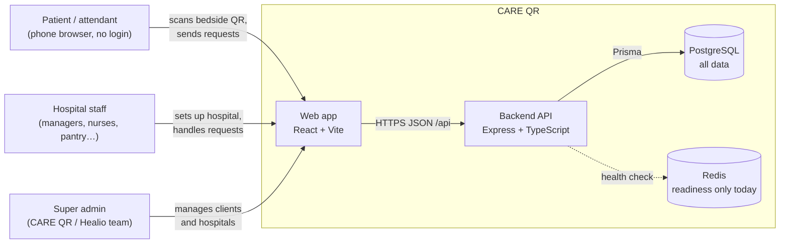
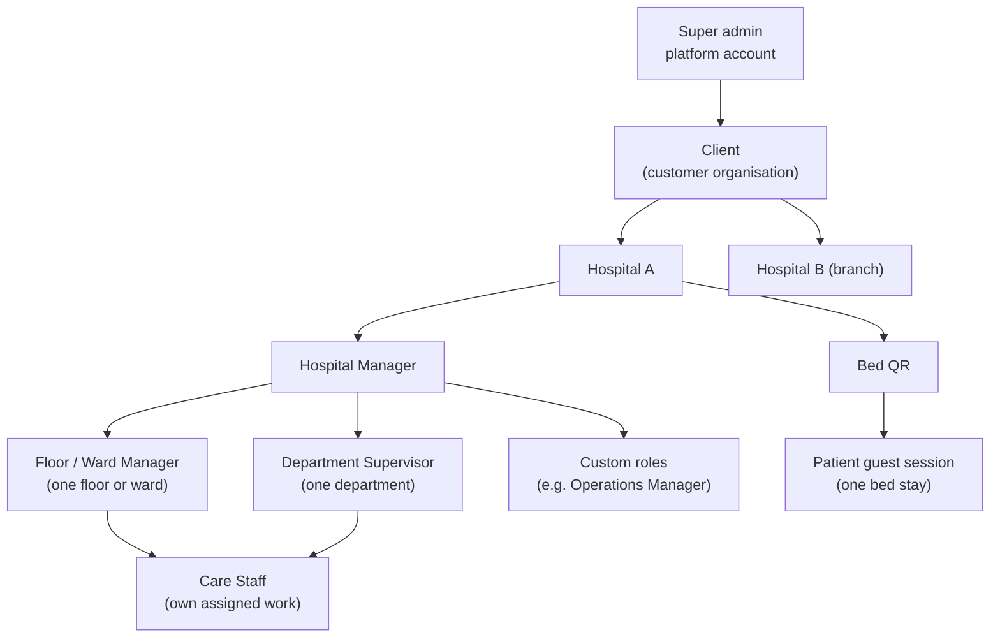
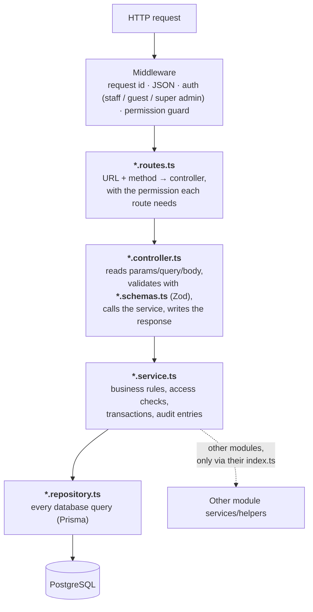
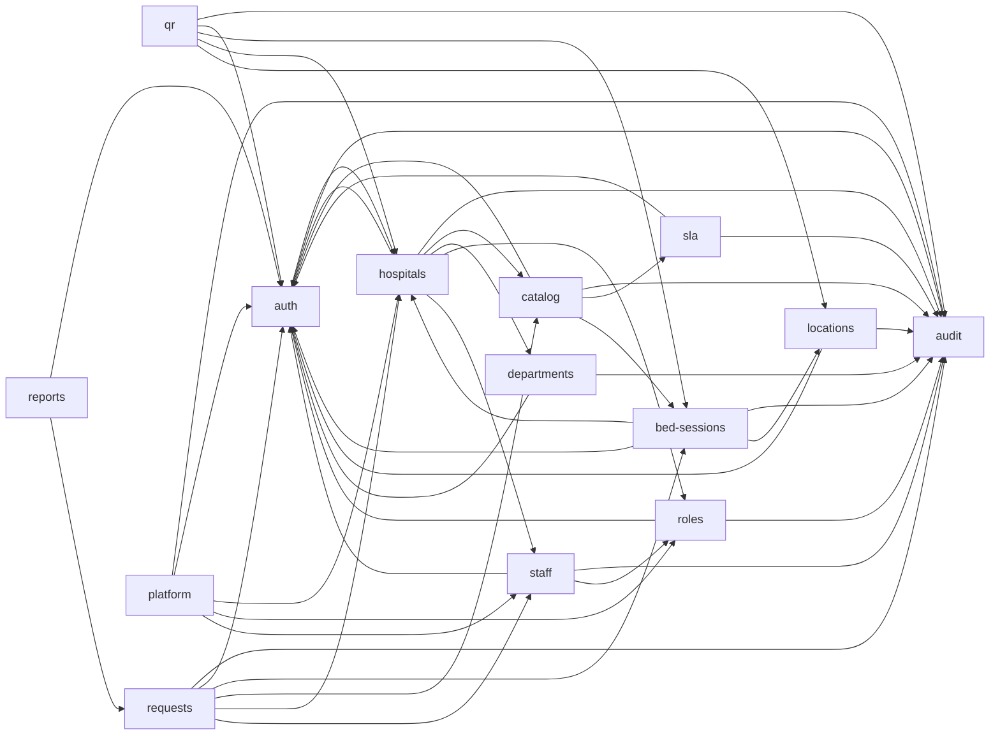
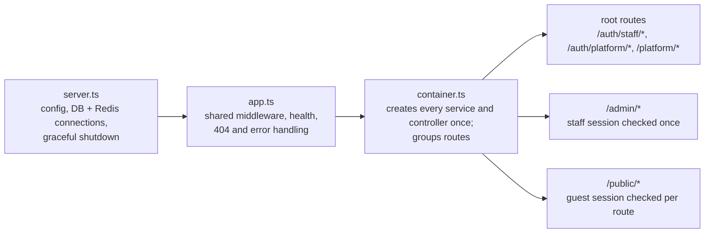

# Architecture

CARE QR is a **modular monolith**: one backend process (Express + Prisma + PostgreSQL) and one web app (React). The backend is split into domain **modules** with clear boundaries, so a module can be moved to its own service later without rewriting it. This page explains how the pieces fit together; the [data flow](./data-flow.md) page follows the data through them.

## 1. System context

Who uses CARE QR and what it talks to.



- The web app serves three areas: the **patient pages** (`/`, `/q/<token>`, `/patient`), the **staff workspace** (`/login`, `/admin/*`), and the **super admin** (`/platform/*`).
- The browser always calls `/api/...`; in development Vite forwards it to the backend on port 3001.
- Redis is required at start-up (readiness), and is reserved for later real-time features and queues.

## 2. Who controls what (SaaS hierarchy)



The super admin manages clients and hospitals only. Everything inside a hospital (layout, staff, roles, requests, reports) belongs to that hospital and is invisible to every other hospital and to the super admin. See [security rules](./security-rules.md) and [module ownership](./modules.md#roles).

## 3. Backend layers

Every module follows the same five layers. A request always travels down and back up through them in this order.



| Layer | Knows about | Never does |
|---|---|---|
| `routes` | paths, HTTP methods, permission guards | business rules, database |
| `controller` | the request and response, schemas, its service | database, other modules' internals |
| `schemas` | input shapes (Zod) and the TypeScript types derived from them | anything else |
| `service` | business rules, the signed-in context, transactions, audit | HTTP objects, raw queries |
| `repository` | Prisma queries for the tables the module needs | business decisions, HTTP |

Rules that are **enforced by lint** (`npm run lint` in `services/`):

1. A module imports another module **only through its `index.ts`** (for example `../auth/index.js`).
2. **Only repositories** touch the database (no `this.database.<table>` or `transaction.<table>` elsewhere).
3. Controllers, routes, and schemas never import Prisma or a repository.
4. A module's `index.ts` never exports a repository, and lists its exports by name (no `export *`).

Services start transactions (`this.database.$transaction(...)`) and pass the transaction to repositories, so everything that must happen together (for example a change and its audit entry) commits or fails together.

### Validation and errors

- Every request body, query string, and URL parameter is checked by a Zod schema in `*.schemas.ts`. Shared field rules (codes, names, emails, passwords, date ranges) live in `src/common/validation.ts`, so every module applies the same limits.
- A failed check returns `400 VALIDATION_ERROR` with a plain sentence about the first problem (for example "Password must be at least 12 characters.") and `fields`, the list of fields to correct (`src/common/validation-errors.ts`).
- A duplicate value returns `409 CONFLICT` naming what is taken ("This code is already in use here."). Unexpected errors return `500` without internal details.
- The web app enforces the same limits before sending (`frontend/src/lib/field-rules.ts`).

## 4. Modules



An arrow means "uses". The full description of each module (tables, public interface, routes) is in [modules](./modules.md).

## 5. How the app is assembled



`container.ts` is the only place where modules are wired together. Adding a module means creating its folder, exporting it from its `index.ts`, and wiring it in the container (see [adding a feature](../adding-a-feature.md)).

## 6. Folder structure

```text
QR_Hospital_management/
├── docs/                         ← all documentation (start at docs/README.md)
├── services/                     ← backend
│   ├── prisma/
│   │   ├── schema.prisma         the database model
│   │   └── migrations/           one folder per change (SQL), applied in order
│   ├── src/
│   │   ├── server.ts             process entry point
│   │   ├── app.ts                Express app: middleware, health, errors
│   │   ├── container.ts          composition root: wires every module
│   │   ├── config/               environment (env.ts) and logger
│   │   ├── database/             Prisma client, Db type, Redis
│   │   ├── common/               shared errors, validation helpers, tokens
│   │   ├── http/                 shared HTTP pieces: CRUD controller, health routes
│   │   ├── middleware/           request id, staff/guest/super-admin auth, rate limit, errors
│   │   ├── modules/<name>/       one folder per domain module (layers below)
│   │   ├── seeds/                demo and full-test data (scripts only)
│   │   ├── cli/                  command-line tools (bootstrap, seeds, ER diagram)
│   │   └── types/                Express request typing
│   └── tests/                    unit/ and integration/ (real PostgreSQL)
└── frontend/                     ← web app
    ├── src/
    │   ├── main.tsx              routes
    │   ├── api/                  backend client, one file per area
    │   ├── components/           shared UI (Modal, PageHeading, PoweredBy…)
    │   ├── lib/                  shared helpers (QR PDF, logos, request status…)
    │   ├── features/<area>/      pages grouped by feature
    │   └── styles.css
    └── tests/                    component and page tests (Vitest + Testing Library)
```

A backend module folder:

```text
modules/departments/
├── index.ts                    public interface: what other modules and the container may use
├── department.routes.ts        URLs and permissions
├── department.controller.ts    HTTP in/out
├── department.schemas.ts       Zod input schemas and their types
├── department.service.ts       rules, transactions, audit
└── department.repository.ts    database queries
```

Larger modules have one set of files per entity (for example `staff` has `staff.*` and `shift.*`) and small pure helpers named after what they do (for example `locations/bulk-beds.ts`, `staff/eligibility.ts`, `requests/request-scope.ts`).

## 7. Key design decisions

| Decision | Why |
|---|---|
| Modular monolith | One deployable app while the product is young; modules keep boundaries for later extraction ([ADR 0001](./adr-0001-single-app-layout.md)). |
| Tenant ID on hospital-owned tables + composite foreign keys | A hospital cannot reference another hospital's records by mistake; global client, user, and platform tables are separate ([tenant rules](./tenant-rules.md)). |
| Hospital derived from the session, never from input | A forged `hospitalId` in a request body cannot select another hospital. |
| Request snapshots | A request copies its service and response-time target when sent, so later catalog edits never change history ([catalog and SLA](./service-catalog-and-sla.md)). |
| Append-only request events | Reports are rebuilt from history that cannot be edited (database trigger). |
| Version-checked commands | Every request command names the version it saw; a stale screen gets "conflict" instead of overwriting newer work ([state machine](./request-state-machine.md)). |
| QR token hashed | The printed secret is shown once; only its SHA-256 hash is stored ([QR and sessions](./qr-and-sessions.md)). |
| Client above hospital | One customer (a hospital group) can own several hospitals; suspending the client closes all of them at once. |

More: [location hierarchy](./location-hierarchy.md), [staff and departments](./staff-and-departments.md), [security rules](./security-rules.md), [V1 decisions](./v1-decisions.md).
