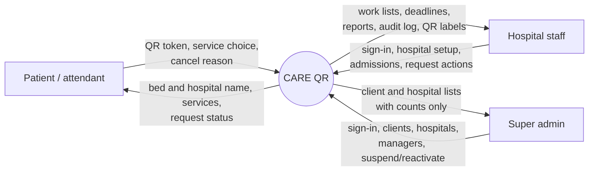
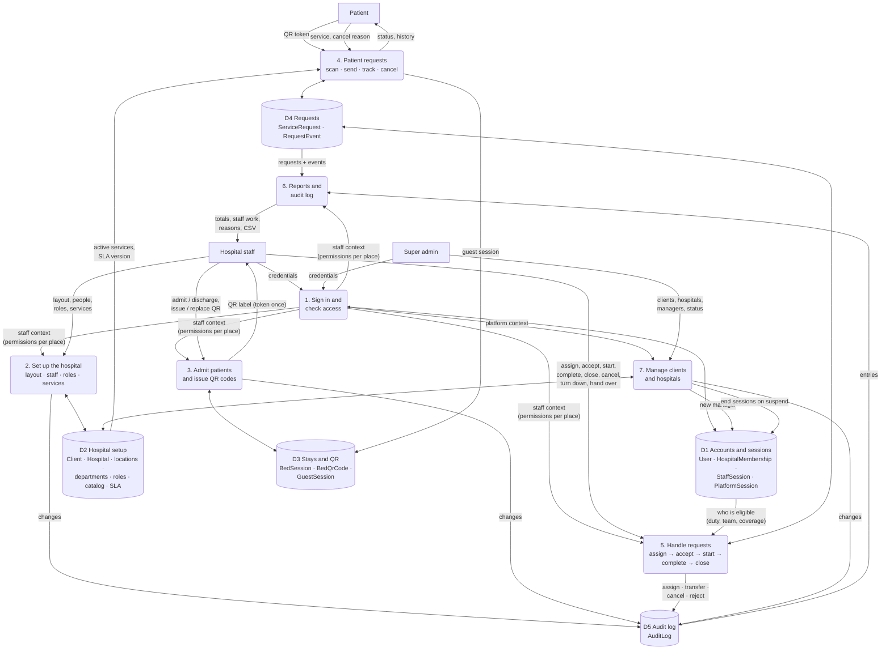
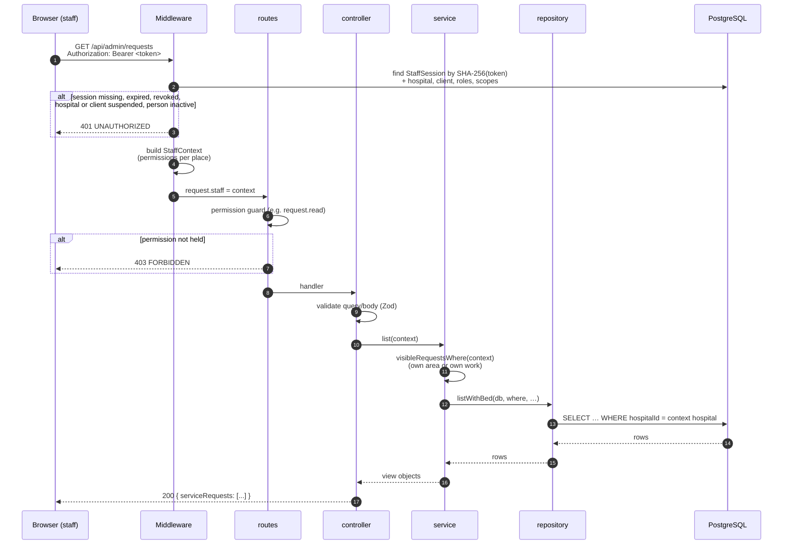
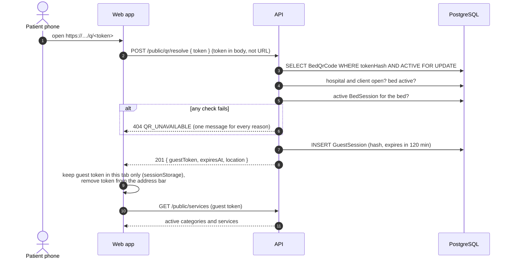
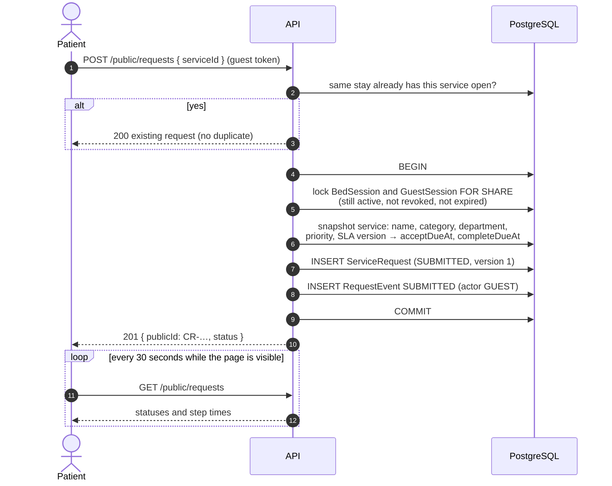
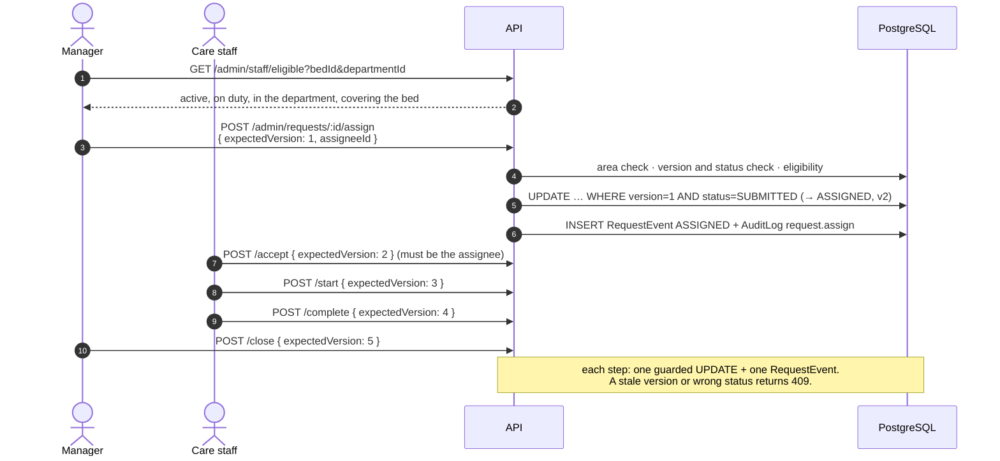
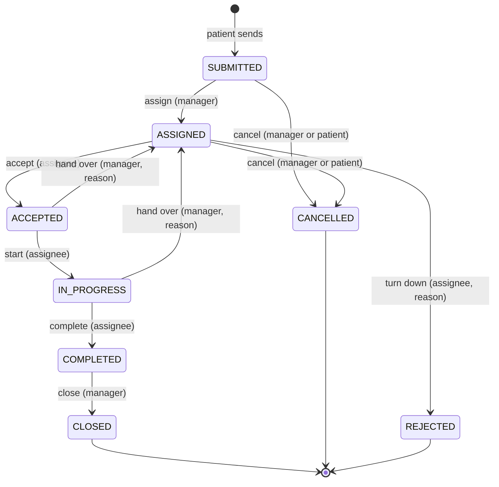
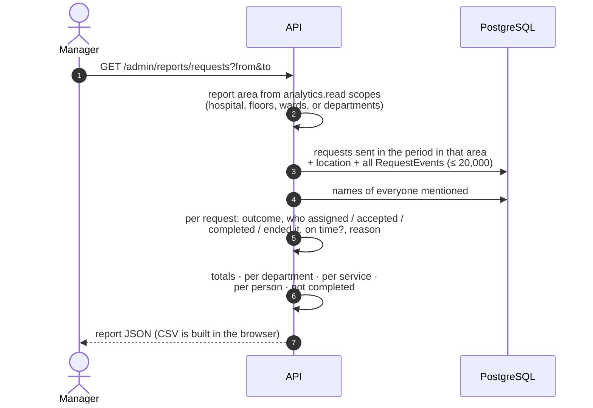
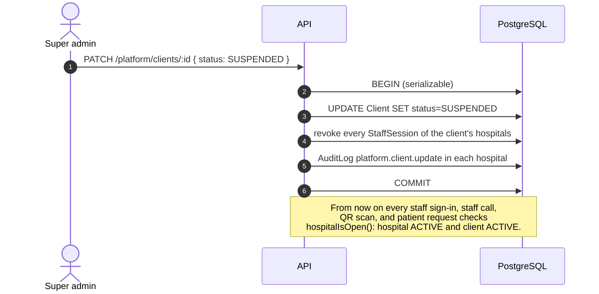

# Data flow

How data moves through CARE QR: first as data flow diagrams (DFD), then step by step for each main flow, then the life of a request.

Notation in the DFDs: rectangles are people outside the system, rounded boxes are processes, cylinders are data stores. Arrow labels are the data that moves.

## 1. Context diagram (DFD level 0)



## 2. Level 1 data flow diagram



## 3. Every authenticated staff call



The hospital always comes from the session, never from the URL or body.

## 4. Admit a patient and print a QR label

```mermaid
sequenceDiagram
  autonumber
  actor M as Manager / Admission desk
  participant API
  participant DB as PostgreSQL
  M->>API: POST /admin/bed-sessions { bedId }
  API->>DB: check bed is in the caller's area
  API->>DB: UPDATE Bed SET status=OCCUPIED<br/>WHERE status=AVAILABLE AND active (race-free)
  API->>DB: INSERT BedSession (ACTIVE) + AuditLog bedSession.start
  API-->>M: 201 bedSession
  M->>API: POST /admin/beds/:id/qr (or /qr-codes/batch)
  API->>API: token = 256 random bits
  API->>DB: INSERT BedQrCode (tokenHash only) + AuditLog qr.generate
  API-->>M: 201 { token, url } (no-store; shown once)
  M->>M: print label PDF (QR = url)
```

Replacing a QR (`/qr/rotate`) stores a new hash and ends every guest session opened with the old one. Closing the bed session ends the stay's guest sessions and sets the bed back to AVAILABLE.

## 5. Patient scans the QR



## 6. Patient sends a request



A unique partial index on (bed session, service) for open requests stops two simultaneous submissions from creating duplicates.

## 7. Staff handle the request



Other paths, each with a required reason that is stored in the event (and the audit log):

- **Turn down** (`/reject`, assignee, from ASSIGNED): the request ends as REJECTED; the patient can send it again.
- **Cancel** (`/cancel`, manager, from SUBMITTED or ASSIGNED; or the patient from their page).
- **Hand over** (`/transfer`, manager, from ACCEPTED or IN_PROGRESS): back to ASSIGNED for another eligible person.

## 8. Request statuses



Deadlines: "accept by" = sent + SLA accept minutes; "complete by" = sent + SLA complete minutes. A request is overdue when the current deadline has passed. Full rules: [request state machine](./request-state-machine.md).

## 9. Reports



Because reports are rebuilt from the append-only event history, they stay correct after hand-overs and cannot be altered after the fact.

## 10. Super admin suspends a client



Reactivating the client restores exactly the previous state: a hospital that was suspended on its own stays suspended.
