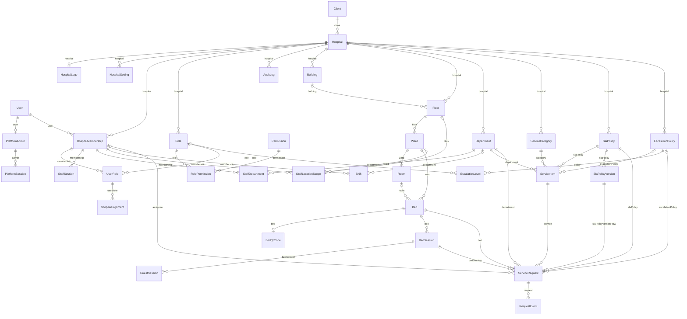
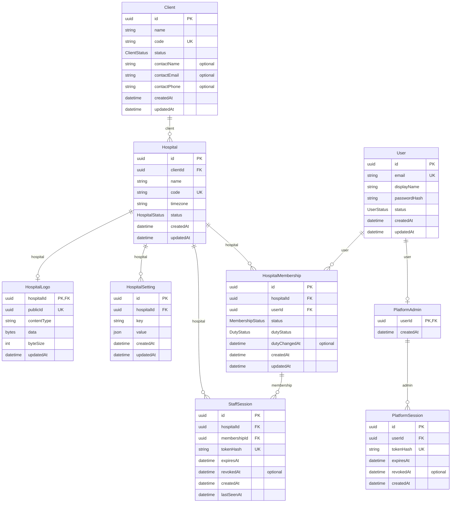
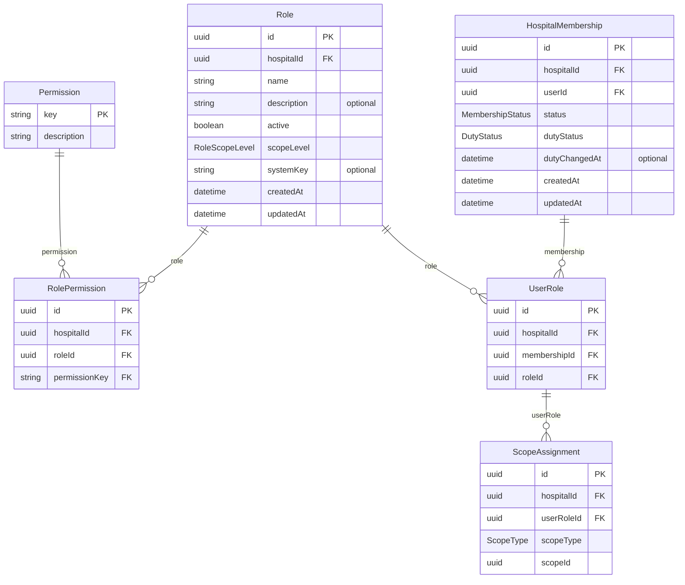
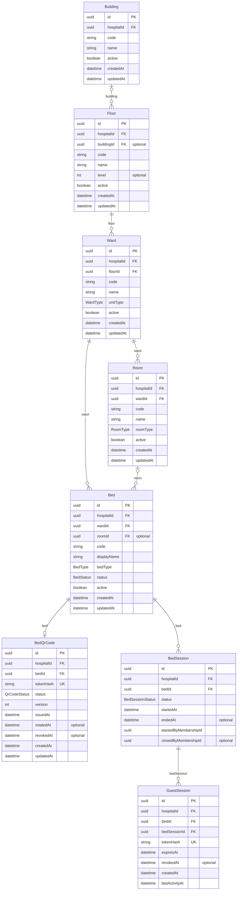
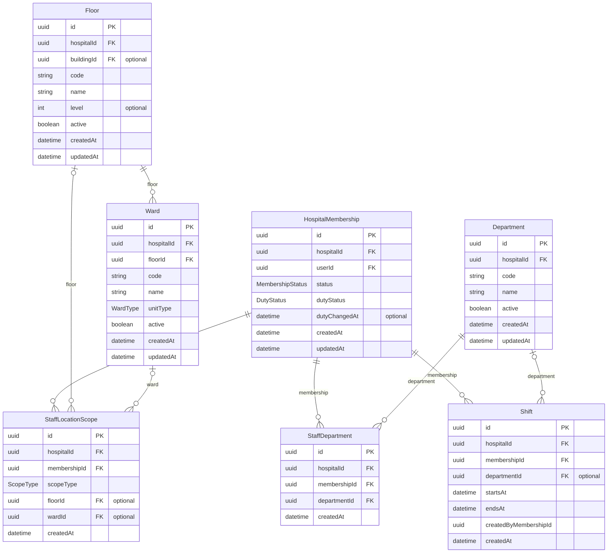
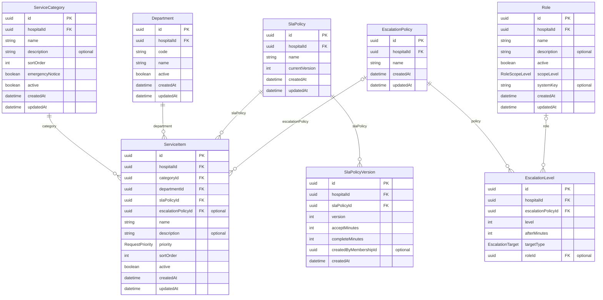
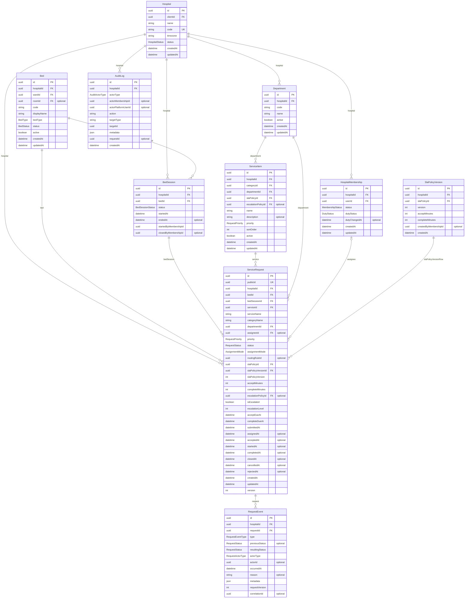

# Database ER diagrams

> Generated by `npm run docs:er` (in `services/`) from `services/prisma/schema.prisma`. Do not edit by hand: change the schema, add a migration, run `npm run prisma:generate`, and then regenerate this file.

How to read the lines: `||` exactly one, `|o` zero or one, `o{` zero or many. The label is the field that holds the link. Keys: **PK** primary key, **FK** foreign key, **UK** unique.

Hospital-owned tables carry `hospitalId`; tenant-owned references use composite foreign keys where needed to prevent cross-hospital links. `Client`, `Hospital`, `User`, `Permission`, `PlatformAdmin`, and `PlatformSession` are platform/global tables.

## Overview (all tables)

Only the main links to `Hospital` are drawn here; the domain diagrams below show every column.

## Clients, hospitals, and sign-in

A client (customer) owns hospitals. A user signs in to a hospital through a membership; super admins have a separate platform account and session.

## Roles and access

A role is a set of permissions. A person holds a role (UserRole) for one or more places (ScopeAssignment): the hospital, a floor, a ward, or a department.

## Locations, QR codes, and patient access

Building → Floor → Ward → Room → Bed. Each bed has at most one QR code. A bed session is one patient stay; scanning the QR creates a short-lived guest session for it.

## Staff, departments, and shifts

Staff belong to departments and cover parts of the hospital. Shifts are informational; duty status decides who can receive work.

## Service catalog and response targets

Services are grouped in categories, handled by a department, and timed by a versioned SLA policy. Escalation policies are configured for later automation.

## Requests and audit

A request copies its service and SLA at submission. Every change appends one RequestEvent (never edited). AuditLog records every administrative change.

## Enumerations

| Enum | Values |
|---|---|
| `HospitalStatus` | `ACTIVE`, `SUSPENDED`, `INACTIVE` |
| `ClientStatus` | `ACTIVE`, `SUSPENDED` |
| `UserStatus` | `ACTIVE`, `INACTIVE` |
| `MembershipStatus` | `ACTIVE`, `SUSPENDED`, `INACTIVE` |
| `ScopeType` | `HOSPITAL`, `FLOOR`, `WARD`, `DEPARTMENT` |
| `AuditActorType` | `SYSTEM`, `STAFF`, `PLATFORM` |
| `RoleScopeLevel` | `HOSPITAL`, `FLOOR`, `WARD`, `DEPARTMENT` |
| `BedStatus` | `AVAILABLE`, `OCCUPIED`, `INACTIVE`, `MAINTENANCE` |
| `WardType` | `GENERAL`, `PRIVATE`, `SEMI_PRIVATE`, `EMERGENCY`, `DAY_CARE`, `MATERNITY`, `LABOUR_ROOM`, `PEDIATRIC`, `ISOLATION`, `BURNS`, `DIALYSIS`, `RECOVERY`, `PSYCHIATRY`, `OTHER` |
| `RoomType` | `GENERAL`, `PRIVATE`, `SEMI_PRIVATE`, `DELUXE`, `SUITE`, `ISOLATION`, `OTHER` |
| `BedType` | `STANDARD`, `ISOLATION`, `PEDIATRIC_COT`, `DAY_CARE_CHAIR`, `DIALYSIS_CHAIR`, `EMERGENCY_TROLLEY`, `LABOUR`, `OTHER` |
| `QrCodeStatus` | `ACTIVE`, `REVOKED` |
| `BedSessionStatus` | `ACTIVE`, `CLOSED` |
| `DutyStatus` | `ON_DUTY`, `OFF_DUTY` |
| `RequestPriority` | `NORMAL`, `HIGH`, `URGENT` |
| `EscalationTarget` | `ASSIGNEE`, `ROLE` |
| `RequestStatus` | `SUBMITTED`, `ASSIGNED`, `ACCEPTED`, `IN_PROGRESS`, `COMPLETED`, `CLOSED`, `CANCELLED`, `REJECTED` |
| `AssignmentMode` | `MANUAL`, `POOL`, `DIRECT`, `AUTO_ASSIGN` |
| `RequestActorType` | `GUEST`, `STAFF`, `SYSTEM` |
| `RequestEventType` | `SUBMITTED`, `ASSIGNED`, `ACCEPTED`, `STARTED`, `COMPLETED`, `CLOSED`, `CANCELLED`, `REJECTED`, `TRANSFERRED` |
